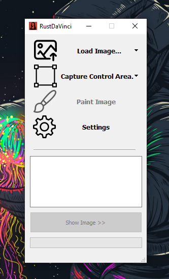
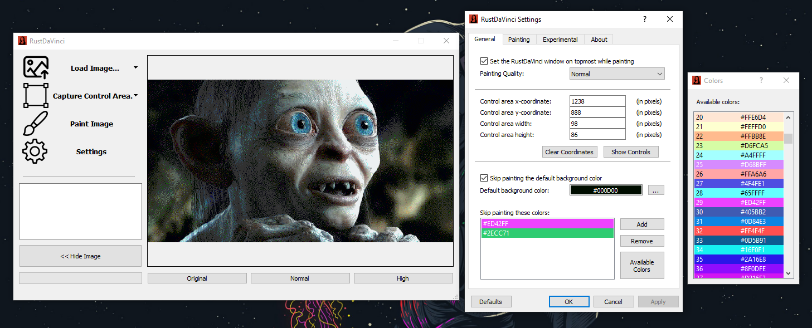
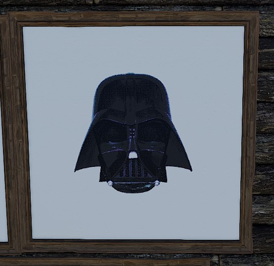
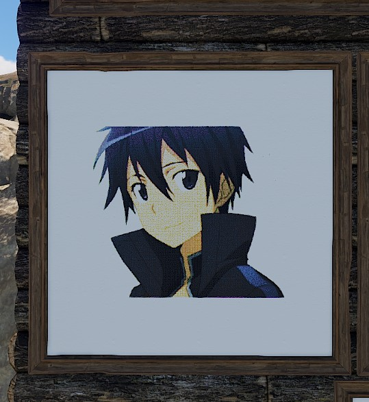
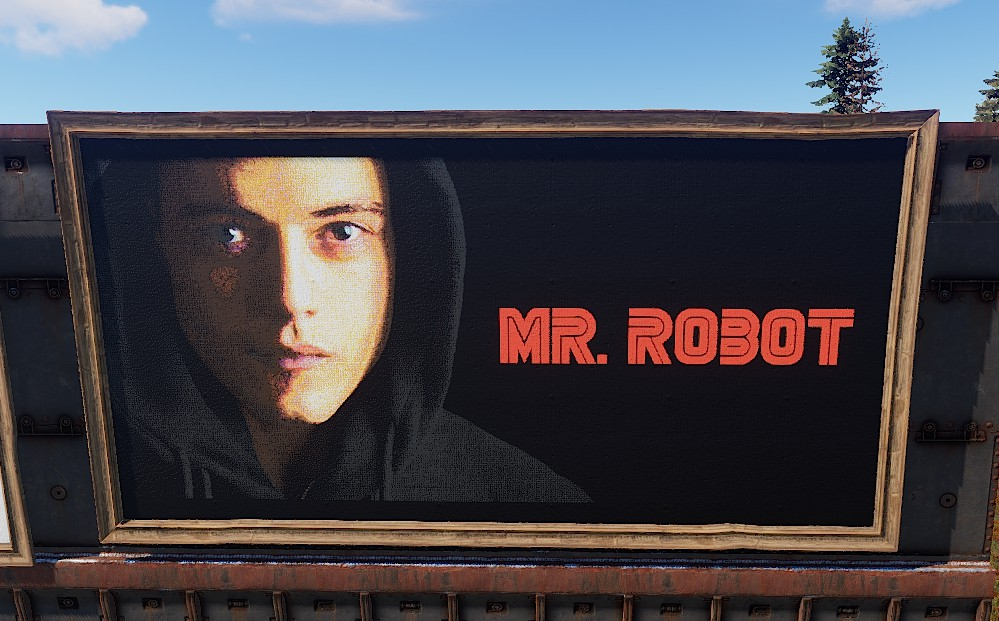
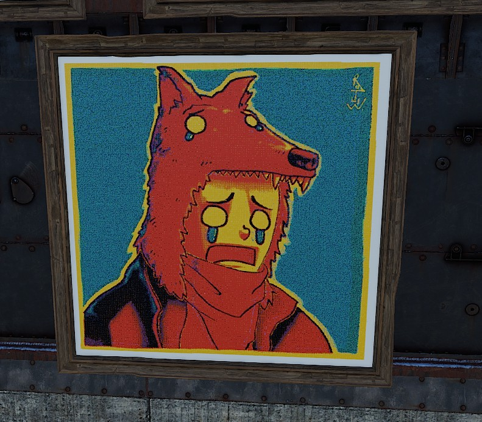
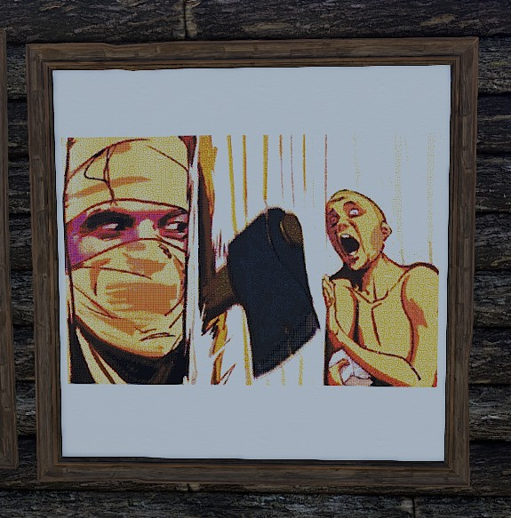
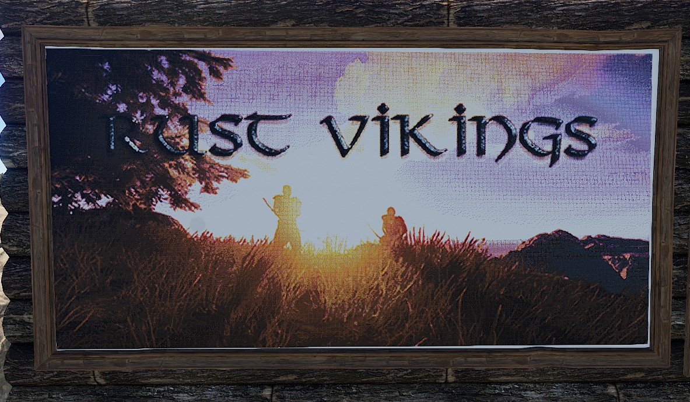
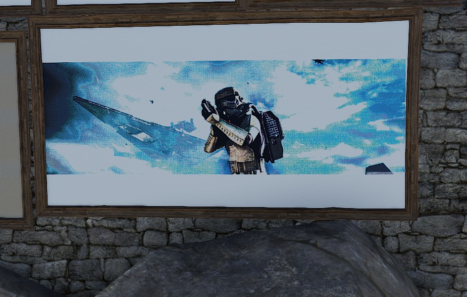
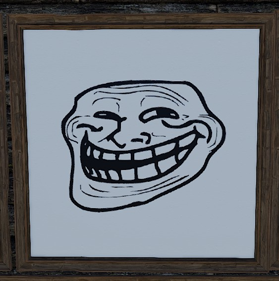

<p align="center">
</a>
</p>

<p align="center">
<a></a>
<a href="https://www.reddit.com/user/Alexemanuelol"></a>
<a href="https://ko-fi.com/alexemanuelol"></a>

<h1 align="center">RustDaVinci - An automatic sign painter for Rust Facepunch</h1>
</p>

## **WARNING!**
*This application have not yet been approved by Facepunch nor EAC. According to Facepunch, the only way for the application to get white-listed with EAC is to publish it on steam. Publishing it on steam comes with a fee of 100$ which I'm not prepared to pay. With this said, I leave the application/ code free and open-source for anyone that is interested to see how I did or potentially contribute.*


## Setup
Python version 3.11.4

Clone the repository with the following command:

``` bash
git clone https://github.com/alexemanuelol/rustdavinci.git
```

Enter the repository and run the following command to install python modules

``` bash
py -m venv .venv
source .venv/Scripts/activate
pip3 install -r requirements.txt
```


## Screenshots




















