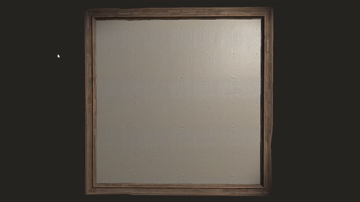
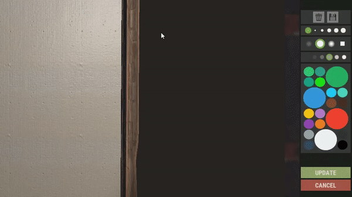

## **WARNING!** This application have not yet been approved by Facepunch nor EAC. According to Facepunch, the only way for the application to get white-listed with EAC is to publish it on steam. Publishing it on steam comes with a fee of 100$ which I'm not prepared to pay. With this said, I leave the application/ code free and open-source for anyone that is interested to see how I did or potentially contribute.

# RustDaVinci - An automatic sign painter for Rust Facepunch

### **https://www.youtube.com/watch?v=QArgjwmhP_Y**

## Features

NOTE: Only tested on Windows 10

* Support for image formats .png, .jpg, .jpeg, .gif
* Import local image or provide URL to image on the internet
* Set pixel perfect location of the paint controls area
* Choose which colors to skip in the painting process
* Setting for utilizing the "hidden colors" which in total paints using 256 possible colors
* Wide variety of settings to allow modification of quality, painting algorithm and used colors
* Setting for drawing lines if calculated to be faster
* Automatically update the canvas whilst painting
* Unlimited painting time
* Automatically paint the background with the background color defined in settings
* Play around with settings such as mouse-click delay, line-draw delay, color changing delay and minimum line width to optimize the speed and accuracy of the painting process.

## How it works

1. Click the "Load Image..." button and select an image from disk or URL
2. Click the "Show Image >>" button to get a preview of how the canvas will look when the painting process is done. There are three buttons when the preview is shown, "Original" which shows the original image, "Normal" that shows the normal quality outcome and "High" which shows the outcome of the high quality dithering algorithm.
3. You can also open settings while the preview is shown to modify things such as "Use the hidden colors palette" and "Improve paintings by utilizing different brush opacities" and immediately see the impact on the preview.
4. When you are satisfied with the settings you can go ahead and click the button "Capture Control Area". This will give you two alternatives, either capture it manually (shown in the gifs below), or capture it automatically using openCV.
5. When the paint control area is captured you can go ahead and click the "Paint Image". This will prompt you to capture the area in which the canvas is located. It's the same procedure as with manually capturing the paint controls area. After that, RustDaVinci will calculate things such as estimated time, amount of pixels to paint, lines to paint, dimensions of the canvas and finaly give you the option to start painting.
6. While RustDaVinci is painting it is recommended to not move the mouse nor keyboard. You can follow the progress both from the progressbar and also the output window which shows what colors it's on. During the painting process, it is possible to cancel the painting process (default ESC), pause the painting process (default F10) or skip the current color (default F11).







## Setting up for contribution
Make sure you read the [CONTRIBUTING.md](CONTRIBUTING.md) file to setup a dedicated rust server.

Clone the repository with the following command:

``` bash
git clone https://github.com/alexemanuelol/RustDaVinci.git
```

Enter the repository and run the following command to install python modules

``` bash
pip3 install -r requirements.txt
```

## Screenshots


